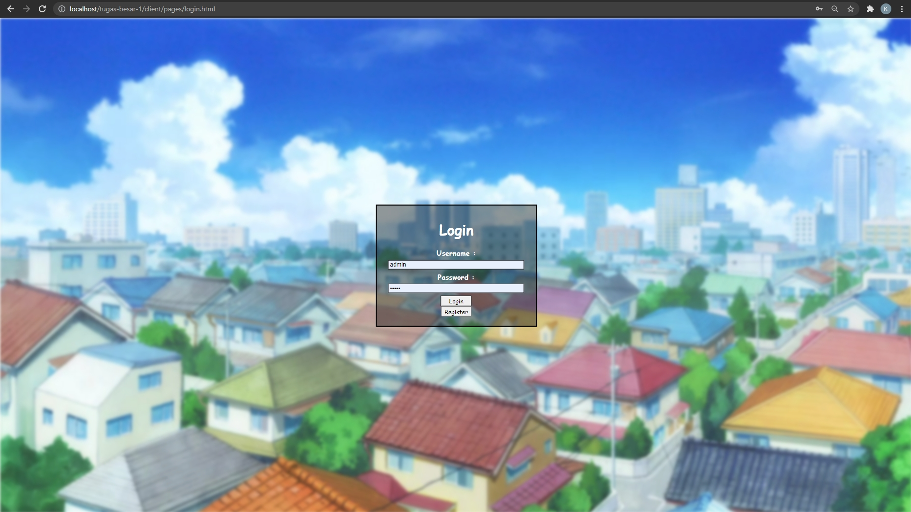
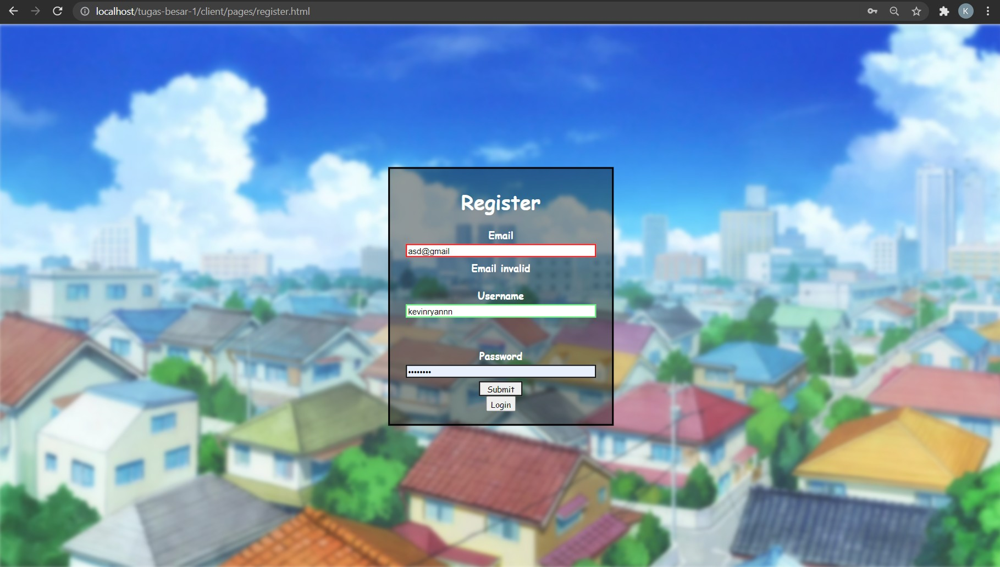
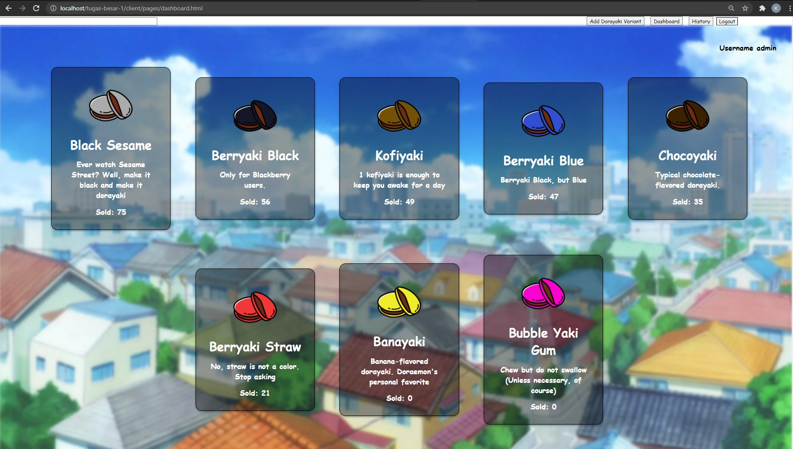
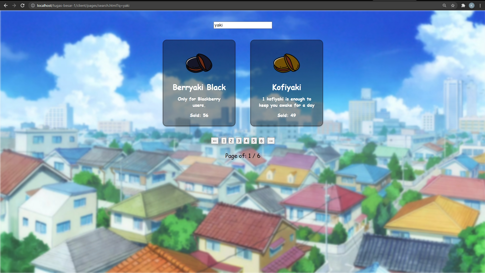
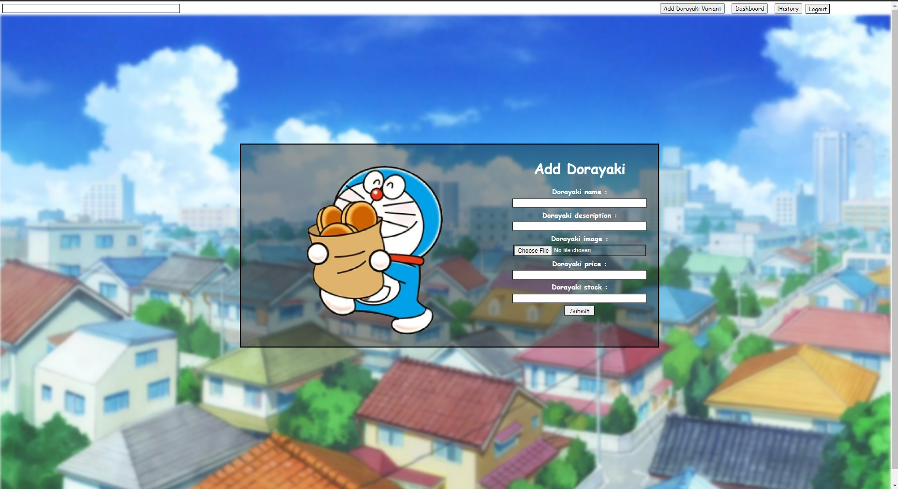
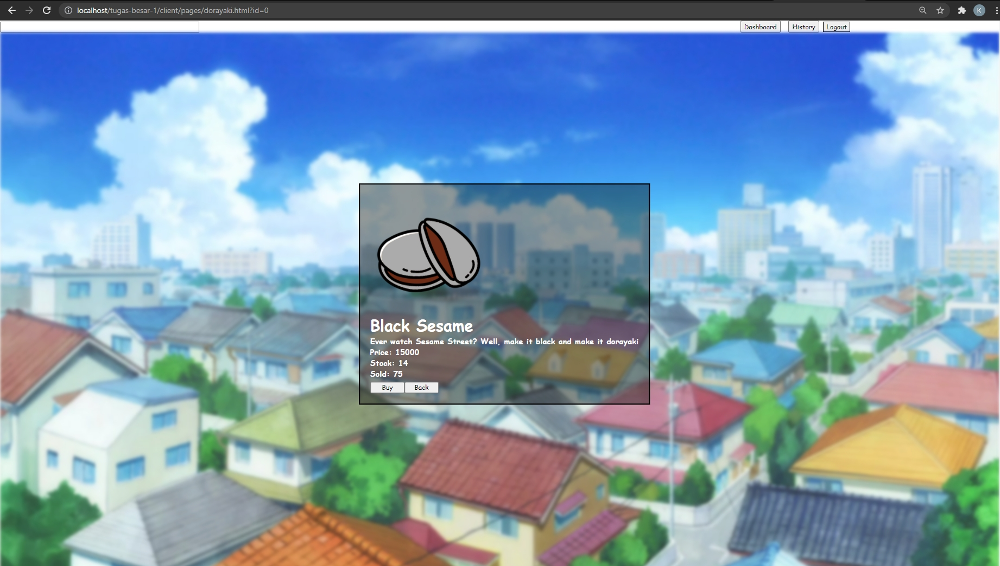
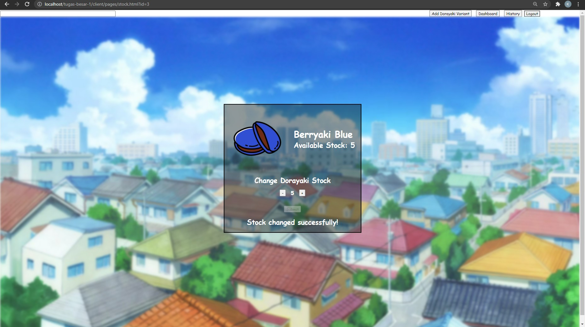
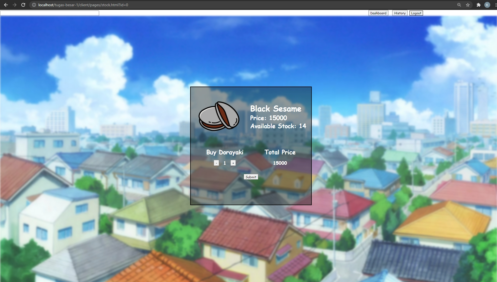
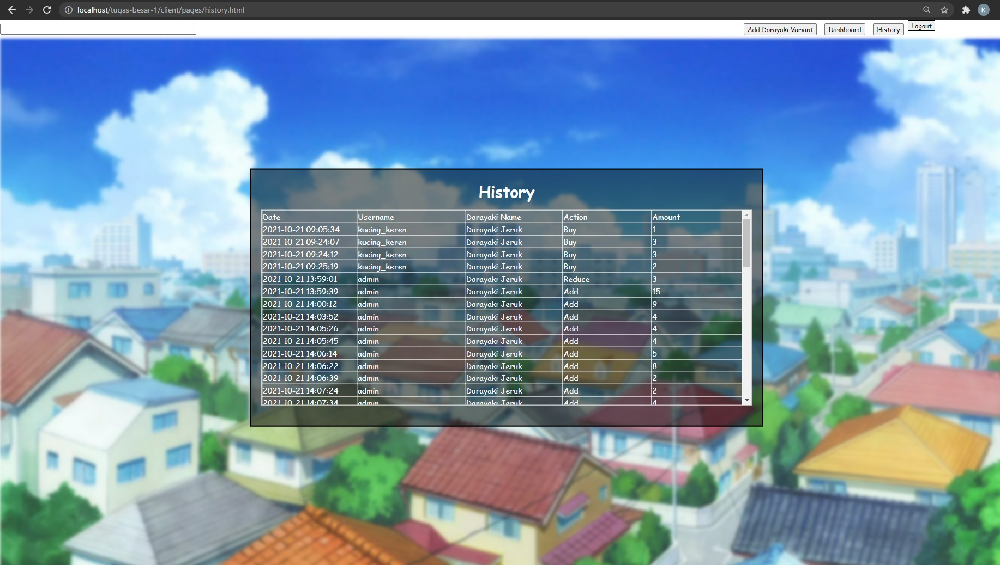
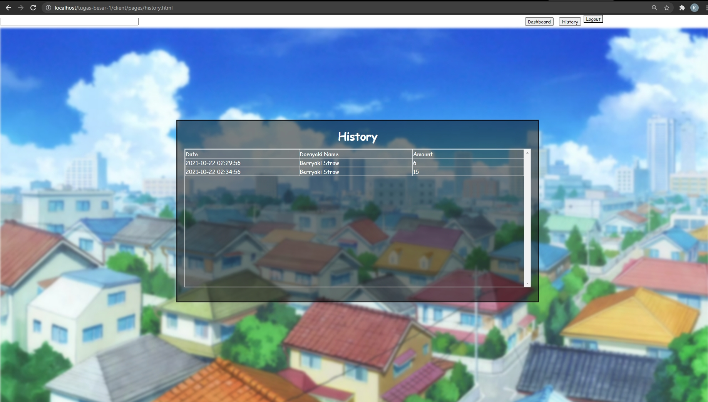

# Mahi Mahi
Kelompok 11 Web Based Development IF3110

## Deskripsi
Web ini merupakan platform jual beli berbagai varian dorayaki. User dapat melakukan registrasi akun untuk web dan dapat melakukan login untuk melihat list varian dorayaki, membeli dorayaki, dan melihat riwayat pembelian.

## Daftar Requirement
1. XAMPP
2. SQLite3

## Cara Instalasi
1. Install XAMPP versi 8.0.12 pada link [ini](https://www.apachefriends.org/download.html)
2. Install SQLite3 sesuai dengan spesifikasi PC Anda pada link [ini](https://www.sqlite.org/download.html)

## Cara Menjalankan Server
1. Clone repository ini dan pindahkan ke dalam `./xampp/htdocs`
```sh
git clone https://gitlab.informatika.org/if3110-2021-01-11/tugas-besar-1.git
```
2. Buka `php.ini` di dalam `./xampp/php` dengan text editor pilihan masing-masing
3. Search `sqlite` pada `php.ini` dan melakukan pengubahan sedemikian rupa sehingga menjadi seperti berikut
```sh
;;;;;;;;;;;;;;;;;;;;;;
; Dynamic Extensions ;
;;;;;;;;;;;;;;;;;;;;;;
..
..
extension=php_pdo_sqlite.dll
```
dan
```sh
; The MIBS data available in the PHP distribution must be installed.
; See http://www.php.net/manual/en/snmp.installation.php
;extension=snmp
..
..
extension=php_sqlite3.dll
```
4. Buka aplikasi XAMPP dan lakukan <b>Start</b> pada module <b>Apache</b>
5. Dengan menggunakan web browser masing-masing, masukkan URL:
```sh
http://localhost/tugas-besar-1/client/index.html
```

## Screenshot
### Login


### Register


### Dashboard


### Hasil Pencarian


### Penambahan Varian Dorayaki Baru


### Detail Varian Dorayaki


### Pengubahan Stock / Pembelian Dorayaki
#### Pengubahan Stock


#### Pembelian Dorayaki


### Riwayat Pengubahan Stock / Pembelian Dorayaki
#### Riwayat Pengubahan Stockt


#### Riwayat Pembelian Dorayaki


## Pembagian Tugas
<u>Server Side:</u><br>
Login                                   : 13519191<br>
Register                                : 13519191<br>
Dashboard                               : 13519015<br>
Hasil Pencarian                         : 13519118<br>
Penambahan Varian Dorayaki Baru         : 13519191<br>
Detail Varian Dorayaki                  : 13519015<br>
Pengubahan Stock / Pembelian Dorayaki   : 13519118<br>
History                                 : 13519118, 13519191<br>

<u>Client Side</u><br>
Login: 13519191<br>
Register: 13519191<br>
Dashboard: 13519015<br>
Hasil Pencarian: 13519118<br>
Penambahan Varian Dorayaki Baru: 13519191<br>
Detail Varian Dorayaki: 13519015<br>
Pengubahan Stock / Pembelian Dorayaki: 13519118<br>
History: 13519118, 13519191<br>